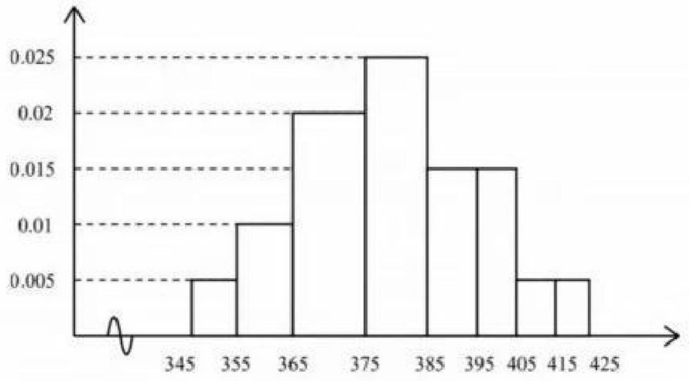
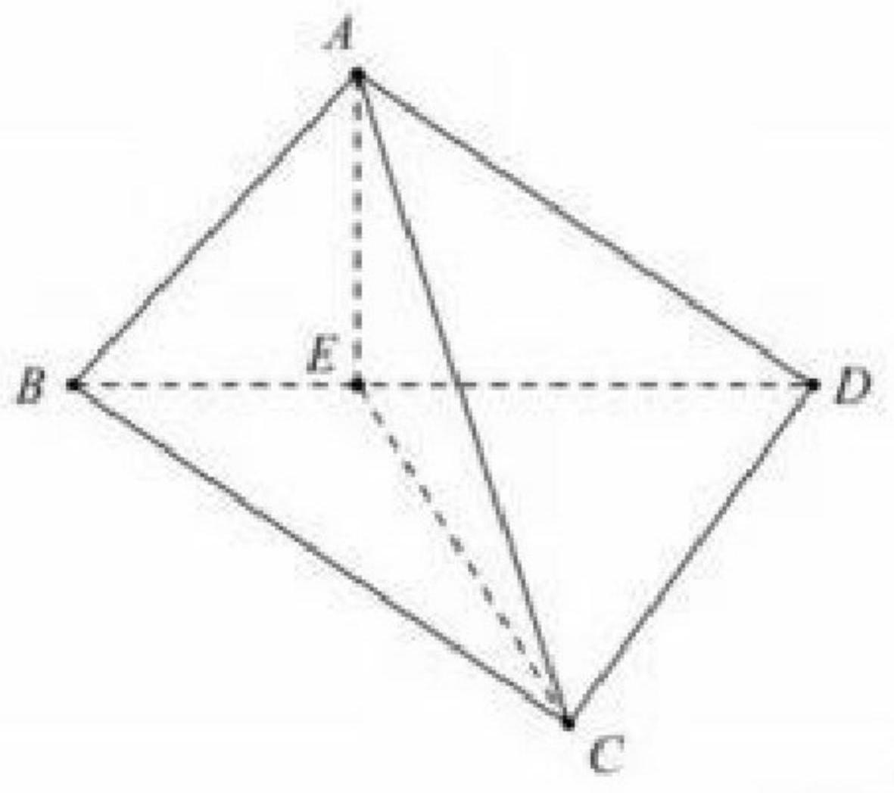

# 2026 年普通高等学校招生全国统一考试（新高考 II 卷）

# 数　学

> **考试时间：120 分钟　　满分：150 分**
>
> **本试卷分选择题和非选择题两部分。**

---

## 注意事项

1. 答卷前，考生务必将自己的姓名、准考证号填写在答题卡上。
2. 回答选择题时，选出每小题答案后，用铅笔把答题卡上对应题目的答案标号涂黑。如需改动，用橡皮擦干净后，再选涂其它答案标号。回答非选择题时，将答案写在答题卡上，写在本试卷上无效。
3. 考试结束后，将本试卷和答题卡一并交回。

---

## 一、单项选择题

**本题共 8 小题，每小题 5 分，共 40 分。在每小题给出的四个选项中，只有一项是符合题目要求的。**

**1．** $(1-3\mathrm{i})^{2}=$

$$\text{A.}\ -8+6\mathrm{i} \qquad \text{B.}\ -8-6\mathrm{i} \qquad \text{C.}\ 8+6\mathrm{i} \qquad \text{D.}\ 8-6\mathrm{i}$$

---

**2．** 若 $A=\{0,1,3,6,9\}$，$B=\{x\mid\sqrt{x}=x\}$，则 $A\cap B=$

$$\text{A.}\ \{0,1\} \qquad \text{B.}\ \{3,6\} \qquad \text{C.}\ \{0,1,9\} \qquad \text{D.}\ \{3,6,9\}$$

---

**3．** 已知向量 $\boldsymbol{a},\ \boldsymbol{b}$ 满足 $|\boldsymbol{a}+\boldsymbol{b}|=1,\ |\boldsymbol{a}-\boldsymbol{b}|=\sqrt{3}$，则 $\boldsymbol{a}\cdot\boldsymbol{b}=$

$$\text{A.}\ 2 \qquad \text{B.}\ 1 \qquad \text{C.}\ -\dfrac{1}{2} \qquad \text{D.}\ -2$$

---

**4．** 双曲线 $C:\ \dfrac{x^{2}}{a^{2}}-\dfrac{y^{2}}{b^{2}}=1$（$a>0,\ b>0$）过点 $(1,0)$ 和 $\left(\dfrac{\sqrt{7}}{2},\ 3\right)$，则 $C$ 的渐近线方程为

$$\text{A.}\ y=\pm 3\sqrt{2}\,x \qquad \text{B.}\ y=\pm 2\sqrt{3}\,x \qquad \text{C.}\ y=\pm\dfrac{\sqrt{6}}{3}\,x \qquad \text{D.}\ y=\pm\dfrac{\sqrt{2}}{6}\,x$$

---

**5．** 棱台上下底面均为有一个内角为 $60°$ 的菱形，且上下底面边长分别为 $2$、$3$，该棱台的高为 $\sqrt{3}$，则该棱台体积为

$$\text{A.}\ \dfrac{19}{12} \qquad \text{B.}\ \dfrac{19}{6} \qquad \text{C.}\ \dfrac{19}{4} \qquad \text{D.}\ \dfrac{19}{2}$$

---

**6．** 甲、乙、丙、丁等 8 人分为 $A$、$B$ 两技术小组，要求每组 4 人，且甲、乙必须在一组，丙、丁不能在一组，则分配的方案种数为

$$\text{A.}\ 10 \qquad \text{B.}\ 12 \qquad \text{C.}\ 16 \qquad \text{D.}\ 24$$

---

**7．** 已知 $\alpha$ 为第二象限角，且 $3\sin 2\alpha\cos\alpha = 8\sin\alpha\cos 2\alpha$，则 $\dfrac{1+\sin\alpha}{2-\cos\alpha}=$

$$\text{A.}\ \dfrac{3}{4} \qquad \text{B.}\ \dfrac{3}{2} \qquad \text{C.}\ \dfrac{1}{2} \qquad \text{D.}\ \dfrac{5}{8}$$

---

**8．** 若 $f(x)$ 为偶函数，且 $f(x)+f(x-2)=0$，当 $x\in\left[\dfrac{3}{2},\ 3\right]$ 时，$f(x)=x^{2}+ax+b$，则

$$\text{A.}\ a=-2,\ b=-3 \qquad \text{B.}\ a=-2,\ b=3 \qquad \text{C.}\ a=-4,\ b=-3 \qquad \text{D.}\ a=-4,\ b=3$$

---

## 二、多项选择题

**本题共 3 小题，每小题 6 分，共 18 分。全部选对的得 6 分，部分选对的得部分分，有选错的得 0 分。**

**9．** 已知 $\odot O:\ x^{2}+y^{2}=1$，$\odot A:\ x^{2}+y^{2}-6x-8y+k=0$，则

- A．点 $A$ 的坐标为 $(-3,\ -4)$
- B．当 $k=9$ 时，$\odot A$ 与 $x$ 轴相切
- C．当 $k=-11$ 时，$\odot A$ 和 $\odot O$ 相切
- D．当 $\odot O$ 和 $\odot A$ 相交时，两交点所在直线方程为 $6x+8y-k-2=0$

---

**10．** 等比数列 $\{a_n\}$ 的公比 $q\neq 1$，$a_1>0$，$2a_3=a_1+a_2$，记 $\{a_n\}$ 的前 $n$ 项和为 $S_n$，则

- A．$q=-\dfrac{1}{2}$
- B．$S_n>\dfrac{2}{3}a_1$
- C．$2S_{n+2}=S_{n+1}+S_n$
- D．$\displaystyle\sum_{k=1}^{n}S_k>\dfrac{2n}{3}a_1$

---

**11．** 已知抛物线 $C:\ y^{2}=8x$，斜率为 $k$ 的直线 $l$ 过点 $(-1,0)$，$\triangle ABC$ 为等边三角形，且 $A$ 在 $y$ 轴上，$B$、$C$ 均在 $l$ 上，则

- A．抛物线 $C$ 的准线方程为 $x=-2$
- B．$l$ 与 $x$ 轴的交点为 $(0,\ -k)$
- C．当 $l$ 与 $C$ 相切时，$AB$ 过 $C$ 的焦点 $F$
- D．当 $l$ 的斜率为 $2$ 时，$\triangle ABC$ 面积的最小值为 $\dfrac{\sqrt{13}}{13}$

---

## 三、填空题

**本题共 3 小题，每小题 5 分，共 15 分。**

**12．** 记 $S_n$ 为等差数列 $\{a_n\}$ 的前 $n$ 项和，若 $a_1=-1$，$a_4=5$，则 $S_6=$ \_\_\_\_\_\_。

---

**13．** 若函数 $f(x)=2^{x}+2^{2-x}-m$ 有两个零点，则 $m$ 的取值范围为 \_\_\_\_\_\_。

---

**14．** 球 $O$ 的体积为 $4\sqrt{3}\,\pi$，点 $A$、$B$、$C$、$D$ 均在球面上，$\triangle ABC$ 为正三角形，若 $DA=DB=DC=\sqrt{2}$，则 $\triangle ABC$ 的面积为 \_\_\_\_\_\_。

---

## 四、解答题

**本题共 5 小题，共 77 分。解答应写出文字说明、证明过程或演算步骤。**

---

### 第 15 题（13 分）

某工厂抽取一批电子元件检测，记录第一次出现故障的时间（天），绘制成如下的频率分布直方图：

**(1)** 求第一次出现故障的时间的第一四分位数和中位数；

**(2)** $p$ 为首次故障时间小于 365 天的概率估计值。

- **(i)** 求 $p$；
- **(ii)** 工厂向某用户销售 100 件电子元件，$X$ 为这 100 件产品首次出现故障小于 365 天的件数，若 $X\sim B(100,\ p)$，求 $E(X)$，$D(X)$。

---

### 第 16 题（15 分）

如图，三棱锥 $A\text{-}BCD$ 中，点 $E$ 在 $BD$ 上，且 $AE\perp CE$，$AE\perp DE$，$CD\perp AD$。

**(1)** 证明：$CD\perp AB$；

**(2)** 若 $DE=2$，$BE=1$，$AE=\sqrt{2}$，$CD=2\sqrt{3}$，求直线 $AD$ 与平面 $ABC$ 所成角的正弦值。

---

### 第 17 题（15 分）

在 $\triangle ABC$ 中，已知 $\cos B=\dfrac{3}{4}$，$\cos^{2}(A+C)+\sin A\sin C=1$。

**(1)** 证明：$\triangle ABC$ 为钝角三角形；

**(2)** 若 $\triangle ABC$ 的面积为 $\dfrac{\sqrt{7}}{4}$，求 $\triangle ABC$ 的周长。

---

### 第 18 题（17 分）

椭圆 $E:\ \dfrac{x^{2}}{a^{2}}+y^{2}=1$（$a>1$），过 $E$ 的右焦点且与 $x$ 轴垂直的直线被 $E$ 截得的长度为 $\sqrt{2}$。

**(1)** 求 $E$ 的离心率；

**(2)** $O$ 为坐标原点，给定点 $G(t_0,\ 0)$（$t_0\neq 0$）；$A(x_0,\ y_0)$（$y_0\neq 0$）在 $E$ 上，过点 $A$ 作 $y$ 轴的垂线，垂足为 $B$，$AO$ 与 $GB$ 交于点 $P$，当 $A$ 在 $E$ 上运动时，$P$ 的轨迹为 $M$。

- **(i)** 求 $M$ 的方程，并说明 $M$ 是什么曲线；
- **(ii)** $M$ 是否有中心点？当 $t_0$ 为何值时，$M$ 有中心点？当 $M$ 有中心点时，平移 $M$ 到 $M'$，使 $O$ 为 $M'$ 的中心点，说明 $M'$ 的形状。

---

### 第 19 题（17 分）

已知函数 $f(x)=x\mathrm{e}^{x}+ax+b$，曲线 $y=f(x)$ 在点 $(0,\ f(0))$ 处的切线为 $y=-2x+1$。

**(1)** 求 $a$，$b$；

**(2)** 当 $x>0$ 时，$f(x+m)-f(x)>m$，求 $m$ 的取值范围；

**(3)** 当 $x>0$ 时，$f(x+k)+f(k-x)>2f(k)$，求 $k$ 的最小值。

---

*本试卷 Markdown 版由开源社区整理，仅供学习交流使用。公式采用 KaTeX/MathJax 标准，可在 Obsidian、Typora、Notion 等软件中直接渲染。*